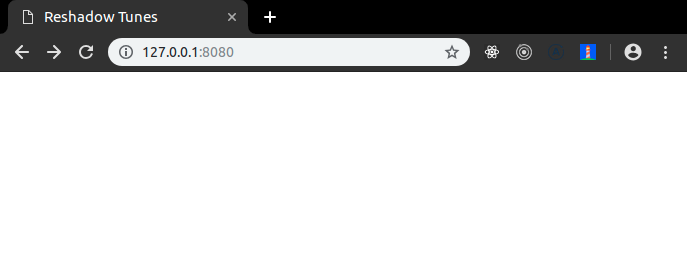
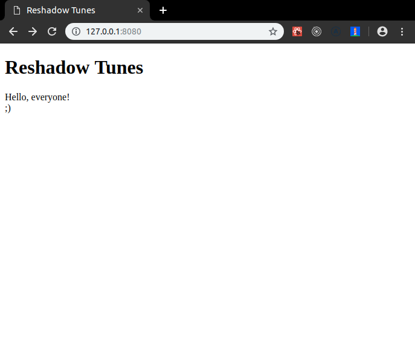
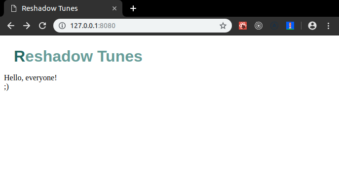
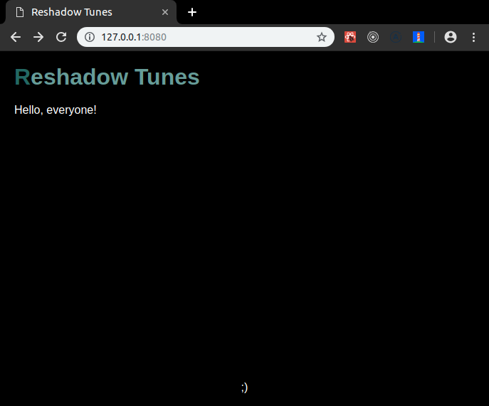
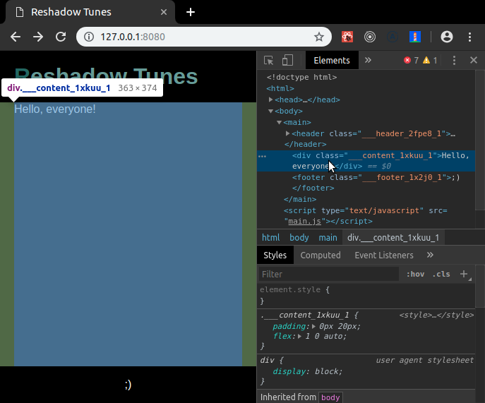

# Туториал. Reshadow Tunes — пишем медиа-галерею "как iTunes" с помощью Reshadow 

В этом туториале мы настроим Webpack, Babel и Reshadow с PostCSS для вёрстки сайтов и соорудим прототип каталога по типу iTunes, чтобы впечатлить вас мощью Reshadow.
Прототип называется Reshadow Tunes, и он будет очень похож на iTunes за счёт [поискового API iTunes'а](https://affiliate.itunes.apple.com/resources/documentation/itunes-store-web-service-search-api/).
Мы покажем вам как удобно пользоваться Reshadow на примере близком к реальной жизни.
Этот туториал особенно подойдёт вам, если вы хотите начать работать с Reshadow, но не хотите пользоваться преднастроенным Reshadow из Code Sandbox.

TODO: Для новичка
Если вы совсем "на вы" с React'ом, начните лучше с [туториала по React'у](https://ru.reactjs.org/tutorial/tutorial.html).

TODO: Для опытного

## Что такое Reshadow?

Reshadow — это библиотека, которая поможет вам навесить стили на ваши компоненты (написанные на любом фреймворке).
Reshadow очень гибкий и вместе с тем не даст вам ломать вёрстку компонентов вокруг себя, пока вы стилизуете один из них.
Вы можете узнать больше на [официальном сайте Reshadow](https://reshadow.dev/).

## Приступаем

Конечно же мы будем пользоваться GIT'ом для управления версиями кода.
Чтобы сравнивать ваши сорцы с "гарантированно работающей" копией туториала, склонируйте оригинальный репозиторий:

```sh
git clone https://github.com/quasiyoke/reshadow-example-tunes.git
```

Теперь сделайте чекаут к initial-комиту, чтобы начать практически с чистого листа:

```sh
cd reshadow-example-tunes
git checkout 00-initial
```

Директория проекта содержит только стандартный `.gitignore` файл для Node.js, "ридми", папку `docs` и лицензию — никаких исходников:

```sh
$ ls -a
.  ..  docs  .git  .gitignore  LICENSE  README.md
```

Для работы нам понадобится Node.js и `npm`.
Убедитесь, что у вас эти программы не слишком отличаются по версии:

```sh
$ node -v
v11.10.0
$ npm -v
6.7.0
```

Прежде всего мы создадим с помощью `npm` файл `package.json`:

```sh
$ npm init
package-name: reshadow-example-tunes
version: 0.1.0
description: Catalog of media assets
entrypoint: index.js
test command:
git repository:
keywords:
author:
license: MIT
```

`npm` сохранит ваши ответы на вопросы в файле `package.json`.
Чтобы сравнить ваш файл `package.json` с работающей копией на теге `01-package.json`, используйте следующую команду GIT'а:

```sh
git diff 01-package.json -- package.json
```

## Настройка webpack

Чтобы сделать из обширных исходников, которые мы напишем, компактные бандлы, мы будем использовать webpack.
В конце главы у нас будет открываться беленькая и пустая страничка в браузере, готовая к отображению вёрстки.

Вызовите `npm` чтобы установить webpack:

```sh
npm install --save-dev \
  webpack@4.30.0 \
  webpack-cli@3.3.1 \
  webpack-merge@4.2.1 \
  webpack-dev-server@3.3.1 \
  html-webpack-plugin@3.2.0
```

Создайте `webpack.config.js`:

```js
const path = require('path');
const merge = require('webpack-merge');
const parts = require('./config/webpackParts');

const PATHS = {
  template: path.resolve(__dirname, 'src/index.html'),
};

module.exports = merge([
  parts.page({
    template: PATHS.template,
    title: 'Reshadow Tunes',
  }),
  parts.devServer(),
]);
```

TODO: Зачем нужны партс?

Запишите в файл `config/webpackParts.js` следующий код:

```js
const HtmlWebpackPlugin = require('html-webpack-plugin');

exports.devServer = () => ({
  devServer: {
    overlay: true,
  },
});

exports.page = ({
  template,
  title,
} = {}) => ({
  plugins: [
    new HtmlWebpackPlugin({
      template,
      title,
    }),
  ],
});
```

- `page`-часть конфига свяжет результирующие JS и CSS с тем HTML, с каким прикажем,
- `devServer`-часть конфига позволит нам использовать локальный веб-сервер webpack'а (разработческий сервер) чтобы повысить скорость разработки и мгновенно наблюдать в браузере нашу писанину как только мы нажимаем "Сохранить".

Создайте `src/index.html`:

```html
<!DOCTYPE html>
<html>
  <head>
    <meta charset="utf-8">
    <title><%= htmlWebpackPlugin.options.title %></title>
  </head>
  <body>
    <main></main>
  </body>
</html>
```

Добавьте (на этот раз руками) в файл `package.json`:

```js
{
  /* ... */
  "scripts": {
    "build": "NODE_ENV=production webpack --env production",
    "build:dev": "webpack",
    "dev": "webpack-dev-server --inline --hot"
  },
  /* ... */
}
```

Эти строки позволят нам использовать следующие команды:

- `npm run build` чтобы подготавливать наши сорцы к продакшену и складывать их в директории `dist`,
- `npm run dev` чтобы легко запускать разработческий сервер.

Добавьте в файл `.gitignore`:

```
...
dist/
```

Мы добавили эту строчку, чтобы не дать директории `dist`, предназначенной для артефактов сборки, пролезть в репозиторий.
Не надо пожалуйста хранить в репозитории то, что можно сгенерировать!

Сделайте очень утрированную (мягко говоря) заготовку исходников будущего проекта:

```sh
touch src/index.js
```

После этого наконец-то можно взглянуть на плацдарм для нашего проекта: пустую страничку, собранную webpack'ом, прямо в вашем браузере!
Запустите `npm run dev` и откройте адрес http://127.0.0.1:8080
Вы должны увидеть картину как на скриншоте:



Если вы застряли или не хотите настраивать webpack вручную, сделайте чекаут этого тега:

```sh
git reset --hard 02-webpack
npm install
```

## Готовим React

React и `react-dom` — это очень популярные библиотеки, помогающие спроецировать "чистые" данные в DOM-дерево и манипулировать ими потом на JavaScript.
Ещё React позволит нам очень удобно разместить код приложения по _компонентам_.

В этой главе мы создадим заготовку приложения, в которой раскладка (layout) будет отделена от содержательной части программы.

Давайте установим React!

```sh
npm install --save \
  react@16.8.6 \
  react-dom@16.8.6 \
  react-hot-loader@4.8.4
```

Пакет `react-hot-loader` очень удобен, чтобы "на горячую" заменять части вашего приложения без потери его состояния (state).

Мы будем использовать Babel, чтобы транспилировать современный синтаксис JavaScript в широко поддержанный браузерами язык и использовать популярный в React-сообществе язык разметки JSX.
Запустите:

```sh
npm install --save-dev \
  @babel/core@7.4.4 \
  @babel/preset-env@7.4.4 \
  @babel/preset-react@7.0.0 \
  @babel/plugin-proposal-class-properties@7.4.4 \
  babel-loader@8.0.5
```

В файле `config/webpackParts.js`:

```js
/* ... */
exports.js = () => ({
  module: {
    rules: [
      {
        test: /\.js$/,
        use: 'babel-loader',
      },
    ],
  },
});
```

В файле `webpack.config.js`:

```js
/* ... */
module.exports = merge([
  /* ... */
  parts.js(),
]);
```

Создайте `babel.config.js`:

```js
module.exports = {
  plugins: [
    '@babel/plugin-proposal-class-properties',
    'react-hot-loader/babel',
  ],
  presets: [
    '@babel/preset-react',
    '@babel/env',
  ],
};
```

Теперь давайте напишем простое React-приложение, чтобы проверить, что наша конфигурация работает как надо.
В файле `src/index.js`:

```js
import React from 'react';
import ReactDom from 'react-dom';
import App from './components/App';

ReactDom.render(
  <App />,
  document.querySelector('main'),
);
```

Этот код рендерит компонент `App` в теге `<main>` файла `index.html`.
Давайте реализуем собственно компонент `App` в файле `src/components/App/index.js`:

```js
import React from 'react';
import { hot } from 'react-hot-loader/root';
import Page from '../Page';

const App = () => (
  <Page>
    Hello, everyone!
  </Page>
);

export default hot(App);
```

Компонент `Page` должен быть способен отображать любое заданное ему содержимое внутри себя.
Давайте его напишем в файле `src/components/Page/index.js`:

```js
import React from 'react';
import Header from '../Header'
import Footer from '../Footer'

export default ({
  children,
}) => (
  <>
    <Header />
    {children}
    <Footer />
  </>
);
```

Теперь давайте реализуем компонент `Header` в файле `src/components/Header/index.js`:

```js
import React from 'react';

export default () => (
  <header>
    <h1>Reshadow Tunes</h1>
  </header>
);
```

И наконец компонент `Footer` в файле `src/components/Footer/index.js`:

```js
import React from 'react';

export default () => (
  <footer>
    ;)
  </footer>
);
```

Если вы перезапустите `npm run dev`, вы должны увидеть что-то вроде этого:



Попробуйте отредактировать текст в теге `<h1>`, не перезапуская разработческий сервер — после сохранения вы мгновенно увидите свои правки в браузере.

Если вы застряли или не хотите вручную настраивать Babel для работы с JSX, сделайте чекаут тега `03-react`:

```sh
git reset --hard 03-react
npm install
```

## Настроим наконец Reshadow

Итак, мы сделали довольно типичную настройку webpack'а и Babel и теперь нам надо подключить к сборке Reshadow и PostCSS чтобы задать нашему приложению блистательное отображение.

Для начала давайте воплотим модный дизайн логотипа нашего будущего приложения.

Установите `reshadow` и некоторые утилиты, чтобы склеить его с webpack:

```sh
npm install --save reshadow@0.0.1-alpha.11
npm install --save-dev \
  css-loader@2.1.1 \
  mini-css-extract-plugin@0.6.0
```

Отредактируйте файл `babel.config.js`:

```js
module.exports = {
  plugins: [
    ['reshadow/babel', {
      files: /\.css$/,
      postcss: true,
    }],
    /* ... */
  ],
  /* ... */
};
```

Подключаем Babel-плагин от Reshadow, чтобы он сгенерировал правильные CSS-селекторы для элементов в React-компонентах:
- `postcss: true` — включает парсинг CSS с помощью PostCSS внутри JS-файлов,
- `files: /\.css$/` — даёт возможность резволить CSS-зависимости внутри Reshadow.

Перепишите фрагмент `js` в файле `config/webpackParts.js`:

```js
const MiniCssExtractPlugin = require('mini-css-extract-plugin');

/* ... */

exports.js = () => ({
  plugins: [
    new MiniCssExtractPlugin(),
  ],
  module: {
    rules: [
      {
        test: /\.css$/,
        use: [
          {
            loader: MiniCssExtractPlugin.loader,
            options: {
              hmr: true,
            },
          },
          'css-loader',
        ],
      },
      {
        test: /\.js$/,
        use: [
          'reshadow/webpack/loader',
          'babel-loader',
        ],
      },
    ],
  },
});
/* ... */
```

Подключаем Reshadow-лоадер для webpack, чтобы при сборке Reshadow был вызван для всех CSS-импортов.
лоадер нужен только для статического экстракчеринга)
без него все будет работать, просто стили будут в жс-чанках
и это не только для цсс-импортов, но и для объявлений цсс внутри жс файлов

для 3d party библиотек это довольно важная возможность

ui-кит на решадоу можно подключить вообще никак не меняя сборку

в отличие от библиотек на css-modules, scss и тд

это в общем-то то, из-за чего был некоторый бум китов на styled-components

но если хочется, то можно юзать лоадер и тогда еще и экстракчеринг будет
для библиотек в том числе

Давайте теперь применим кое-какие стили к нашему хедеру.
В файле `src/components/Header/index.js`:

```js
import React from 'react';
import styled from 'reshadow';
import styles from './styles.css';

export default () => styled(styles)(
  <header>
    <h1>Reshadow Tunes</h1>
  </header>
);
```

Функция `styled` из Reshadow соединяет виртуальный DOM компонента со стилями из файла `styles.css`.
Теперь нам надо написать этот CSS в файле `src/components/Header/styles.css`:

```css
header {
  padding: 16px 20px;
}

h1 {
  margin: 0;
  font-family: sans-serif;
  color: #689d99;

  &::first-letter {
    color: #236863;
  }
}
```

CSS-стили хедера делают его текст бирюзового цвета и указывают ему шрифт.

Если вы теперь посмотрите в браузер, вы должны увидеть что-то вроде этого:



Вы можете собрать ваши продакшен статические файлы командой `npm run build`:

```sh
$ npm run build
$ ls dist
index.html  main.css  main.js
```

Если открыть файл `dist/index.html` в вашем любимом браузере, вы убедитесь, что сайт открывается из собранных файликов безо всякого разработческого сервера;
это доказывает, что вы можете в любой момент приостановить разработку и опубликовать минифицированную продакшен-версию вашего творения.

Reshadow — это свежий взгляд на "CSS-in-JS" подход к стилизации.
Люди часто боятся, что CSS-in-JS "вклеит" их стили прямо в JavaScript.
Только не в случае Reshadow.
Откройте `dist/main.css`:

```css
.___header_2fpe8_1{padding:16px 20px}.___h1_2fpe8_1{margin:0;font-family:sans-serif;color:#689d99}.___h1_2fpe8_1:first-letter{color:#236863}
```

Как видите, все наши стили были минифицированы и сохранены в статическом CSS-файле, так что мы можем пользоваться старым добрым кешируемым подходом к доставке таблиц стилей на клиент, не отказываясь при том от потрясного удобства разработки (Developer Experience), которое нам даёт Reshadow.

TODO: Рассказ про скоупинг. Почему это замечательно? Скриншот инспектора.
Скорее всего, вам не нужна "каскадность" CSS.
TODO: найти статью
И вообще, есть мнение, что буква "C" в "CSS" (Cascading Style Sheets) лишняя (за очень редким исключением) — помните об этом.

Если вы застряли, вы можете сделать чекаут GIT-тега `03-reshadow`:

```sh
git reset --hard 03-reshadow
npm install
```

## Как "прибить" футер к низу экрана с помощью Reshadow?

В интернете есть давняя традиция приклеивать футер страницы к низу вьюпорта, когда страница содержит мало контента.
Оглянитесь вокруг, и вы увидите кучу примеров этого шаблона дизайна.

Нашей задачей будет прикрепить футер приложения внизу окна браузера.

Добавьте стили `styles.css` к компоненту `Page` так же, как вы это сделали для `Header`'а.
В файле `src/components/Page/index.js`:

```js
/* ... */
import styled from 'reshadow';
import styles from './styles.css';

export default ({
  children,
}) => styled(styles)(
  <>
    <Header />
    <content>
      {children}
    </content>
    <Footer />
  </>
);
```

Смотрите, мы добавили "HTML-тег" `<content>`, которого нет в стандарте HTML!
В реальности же он не попадёт в DOM-дерево браузера.
По умолчанию Reshadow заменяет все "несуществующие" теги DOM-нодой `<div>`.
Такие теги позволяют вам писать ваши CSS-селекторы необычайно лаконичным, удобным и семантичным образом.
Взгляните как упоминается тег `<content>` в стилях компонента `Page`.
В файле `src/components/Page/styles.css`:

```css
:global(html), :global(body) {
  margin: 0;
  height: 100%;
  background: #000;
  font: 16px/1.3 sans-serif;
  color: #fff;
}

:global(main) {
  display: flex;
  flex-direction: column;
  height: 100%;
}

content {
  padding: 0 20px;
  flex: 1 0 auto;
}
```

TODO: рассказать про :global

Добавьте стили `styles.css` к компоненту `Footer` так же, как мы это делали для `Page`.
В файле `src/compoenents/Footer/styles.css`:

```css
footer {
  padding: 16px 20px;
  text-align: center;
}
```

Вся магия "приклеивания" футера произошла в стилях для `Page` — элемент `<content>` занимает всё свободное пространство, толкая футер к низу вьюпорта.

Результат должен выглядеть вот так:



Если вы "поиграете" с размером окна, вы увидите, что футер всегда будет расположен внизу вьюпорта, а ещё страница будет пристойно выглядеть, когда размер окна слишком мал.

Нажмите F12 и посмотрите в инспекторе, как Reshadow применил ваши стили к DOM'у.
Обратите внимание, что элемент `<content>` превратился в DOM-ноду `<div>`.
Приглядитесь как стили были назначены для тега `<header>`: Reshadow "заскоупил" (scoped) ваши CSS-правила с помощью уникального `className`, специально сгенерированного только под компонент `Header`.
TODO: перенести рассказ про скоупинг к моменту стилизации Header'а чтобы про :global чуть выше хорошо зашло.
Обратите внимание, что main не заскоупил, поскольку мы применили :global.
Постоянно пользоваться `:global` — это дорога в ад.
Используйте конструкцию `:global` только в исключительных случаях.
Редкая необходимость наложить стили на объемлющие теги `<html>`, `<body>` и корневую DOM-ноду приложения Каждый случай наперечёт. Расскажите в [сообществе Reshadow](https://t.me/reshadow) о ситуациях, когда вам понадобился :global, и мы убедим вам, что он на самом деле не нужен.

Разрабатывая один компонент, вы не должны думать о других компонентах, о потенциальной возможности.



Если вы застряли, вы можете сделать чекаут GIT-тега `04-sticky-footer`:

```sh
git reset --hard 04-sticky-footer
npm install
```

## Подключаемся к API

Мы начнём разработку бизнес-логики нашего приложения с подготовки к тому, чтобы делать запросы в [поисковый API iTunes](https://affiliate.itunes.apple.com/resources/documentation/itunes-store-web-service-search-api/).
Мы реализуем React-компонент `Catalog`, который будет спрашивать API на основе введённого пользователем запроса.

Вставьте `Catalog` в компонент `App`.
В файле `src/components/App/index.js`:

```js
/* ... */

import Catalog from '../Catalog';

/* ... */

<Page>
  <Catalog />
</Page>

/* ... */
```

## Создание сниппетов

## Добавляем к компонентам вариативность

Модификаторы

## Вторая (светлая) тема для сайта Reshadow Tunes

## Заключение

Спасибо [Артуру, автору Reshadow](https://twitter.com/_lttb) за помощь в написании туториала.
Заходите на [сайт Reshadow](https://reshadow.dev) за справочной информацией, задавайте вопросы в [чатике Reshadow в Telegram](https://t.me/reshadow).

Всем добра!


*** Primary color:

   SHADE 0 = #236863 = RGB( 35,104, 99) = RGBA( 35,104, 99,1) = RGB0(0.137,0.408,0.388)
   SHADE 1 = #689d99 = RGB(104,157,153) = RGBA(104,157,153,1) = RGB0(0.408,0.616,0.6)
   SHADE 2 = #41837e = RGB( 65,131,126) = RGBA( 65,131,126,1) = RGB0(0.255,0.514,0.494)
   SHADE 3 = #0d4e4a = RGB( 13, 78, 74) = RGBA( 13, 78, 74,1) = RGB0(0.051,0.306,0.29)
   SHADE 4 = #003430 = RGB(  0, 52, 48) = RGBA(  0, 52, 48,1) = RGB0(0,0.204,0.188)

